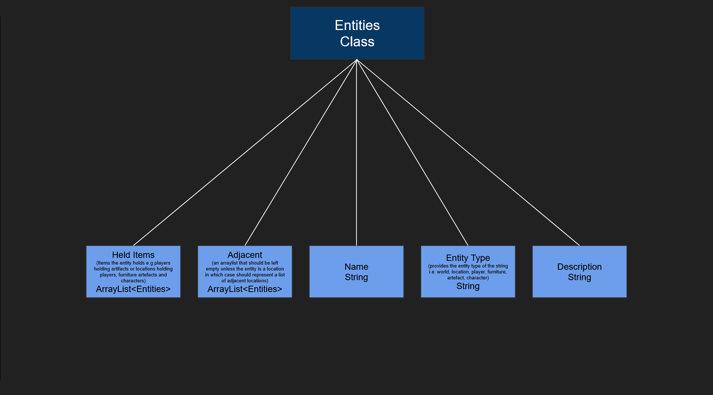
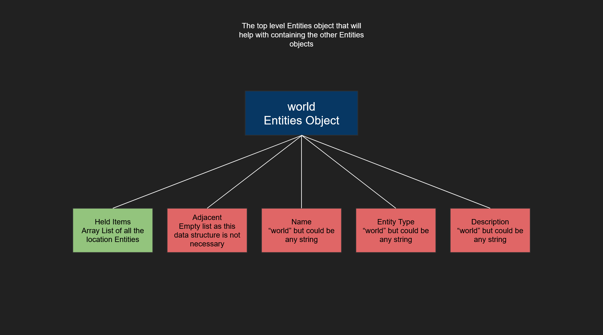
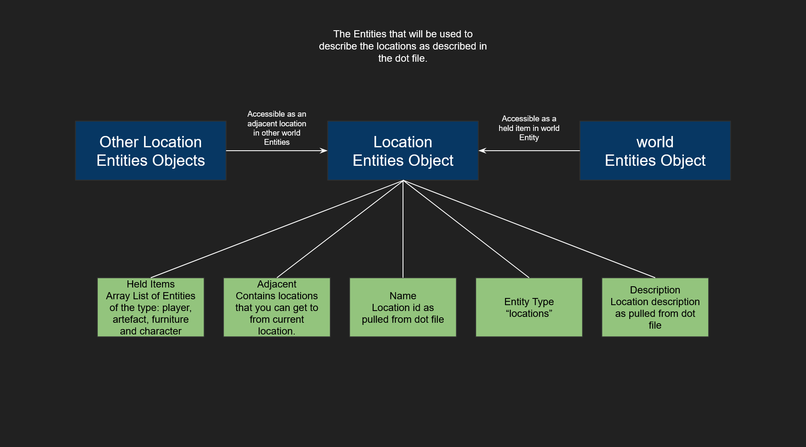
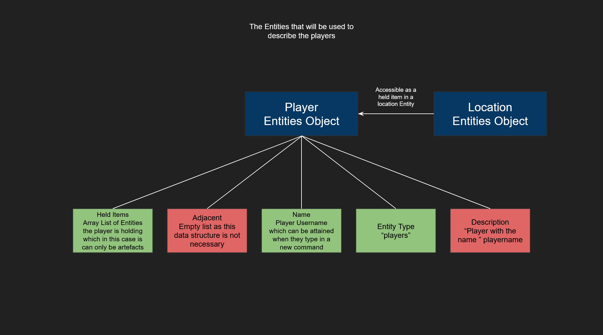
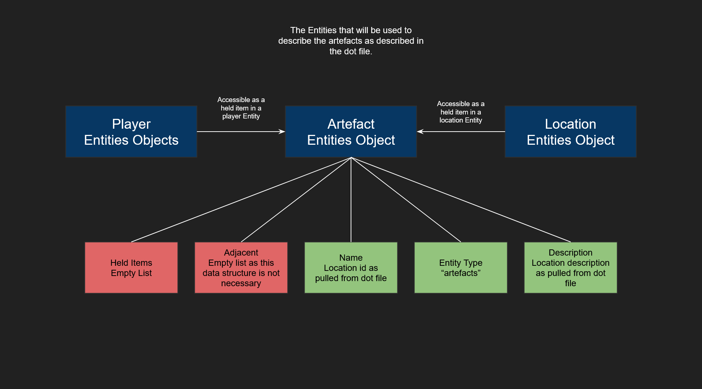
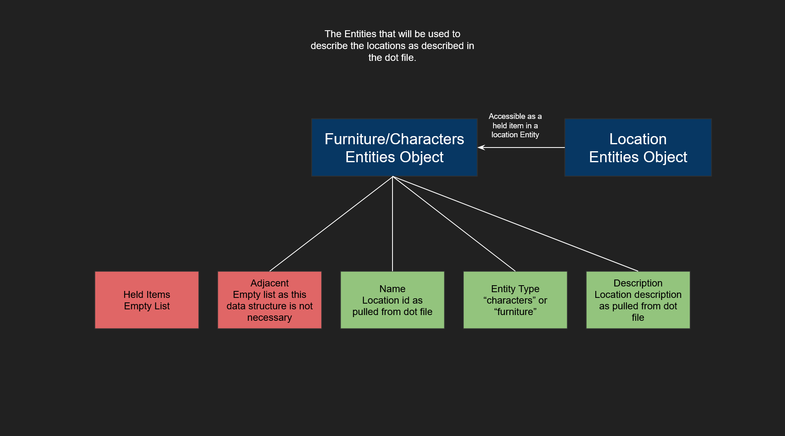
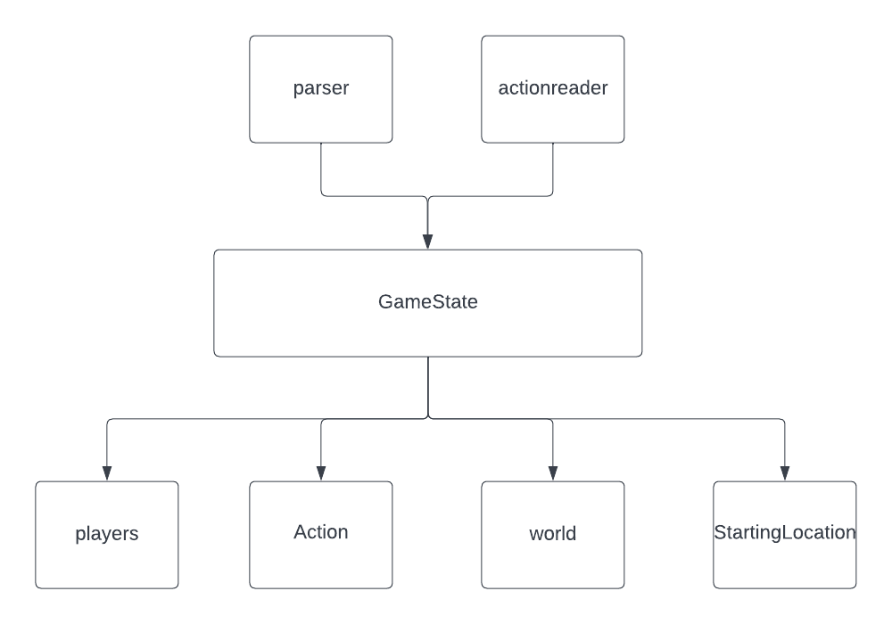

# 2 week project template
[](https://github.com/RichardLitt/standard-readme)
## Table of Contents
- [Group Details](#group-details)
- [Description of the project](#description-of-the-project)
- [The Architecture Diagram of this project](#the-architecture-diagram-of-this-project)
- [Overview](#overview)
- [Building the project](#building-the-project)
- [Running test cases](#running-test-cases)
- [Manually running the Server and Client](#manually-running-the-server-and-client)
- [Details](#details-of-the-class-entities)
  - [Class Entities](#details-of-the-class-entities)
  - [Locations](#details-of-the-location)
  - [Gamestate](#details-of-the-gamestate)
  - [ActionReader](#Details-of-the-ActionReader)
  - [BNF](#details-of-the-bnf)
  - [ReadMe](#link-of-the-readme-file)


## Group Details

Group Name: Trinovanti  
Team member: Dexter Ding , Zhaoyang Hao, Martin Oravec ,Ikenna Offokansi  
Deployment lab machine: it075705.wks.bris.ac.uk  
Group Team Channel: [link](https://teams.microsoft.com/dl/launcher/launcher.html?url=%2F_%23%2Fl%2Fchannel%2F19%3Adb42188b589b483dbab3ac45fcd21d8d%40thread.tacv2%2FTrinovanti%3FgroupId%3D8b4353a8-6124-4039-806f-cfdbe7dee0d8%26tenantId%3Db2e47f30-cd7d-4a4e-a5da-b18cf1a4151b&type=channel&deeplinkId=4a9757fb-b8b9-4b74-af7c-b1b139301c7f&directDl=true&msLaunch=true&enableMobilePage=true)

## Description of the project
This is a simple text adventure game   
The server is deployed on the lab machine to receive the incoming connections and commands  
Then make required changes to the game state and send suitable response to client

## The Architecture Diagram of this project  


## Overview

This template is the skeleton project that acts as the starting point for the SPE summer resit assignment.  
**Note:** that on MS Windows, you might need to replace `./mvnw` with `.\mvnw` in the following commands.

## Building the project

You can compile all of the source code in the project (which is located in `src/main/java`) using the following command:
```
./mvnw clean compile
```

## Running test cases

Run all of the test scripts (which are located in `src/test/java`) using the following command:
```
./mvnw test
```

## Manually running the Server and Client

You can start the server using the following command:
```
./mvnw exec:java@server
```

In a separate terminal, run the client using the following command:
```
./mvnw exec:java@client -D exec.args="username"
```
Where `username` is the the name of the player

##  How to play this game
  There are few commands for you to interact with the game  
the suggested syntax of the command line is 
`trigger` + `subject`  

these are the trigger word you may wish to use:

`get`picks up artefact from the current location  
`drop`puts down artefact from player's inventory  
`inv`lists all artefacts currently being carried  
`goto` moves the player to a new location  
`look` describes all aspects of the current location  
`reset` resets all game state and reloads config file

To see more possible, please check the BNF file for details

## Details of the Entities Class

Entities will be stored in the Entities class which has unique attributes to support the game structure

## Details of  world

The world Entity is a high level Entity which in a sense will contain every Entity

## Details of the Location

Locations are contained in the world entity object  `(Held Items attribute)` 

## Details of the Player



## Details of the Artefacts/Characters/Furniture




## Details of the GameState
  
The game state is built from `parser` and `action reader` in the constructor   
and has four attributes  
`players` which contains all players' information  
`Action`which contains four hashmap to decide whether perform the action and the outcome  
`world` contains all the information of almost everything  
`StartingLocation` the starting point
## Details of the ActionReader


Actions is a tree structure. used to use for loop to get every elements and store them in hashmap,
Use the keyword as the ID of each action.

the upgraded version use the trigger as a key to build four hashmaps  
  
so we could use `trigger` as a key to determine whether actions could be performed
## Details of the BNF
There is a [link](https://github.com/SPE-Summer-Resit-2022/Trinovanti/blob/main/BNF.txt) for our BNF.
## Link of the README FILE
There is a [link](https://github.com/SPE-Summer-Resit-2022/Trinovanti/blob/main/README.md) for our ReadMe File.
